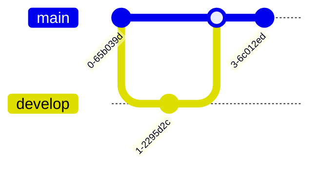

# Mermaid Diagram Types Reference

This document provides syntax examples and use cases for all Mermaid diagram types.

## Flowcharts

**Use for:** Process flows, decision trees, workflows

**Basic syntax:**


**Direction options:** `TD` (top-down), `LR` (left-right), `BT` (bottom-top), `RL` (right-left)

**Node shapes:**
- `[Rectangle]` - Standard box
- `(Rounded)` - Rounded corners
- `([Stadium])` - Pill shape
- `[[Subroutine]]` - Double border
- `[(Database)]` - Cylinder
- `((Circle))` - Circle
- `{Diamond}` - Diamond (decision)
- `{{Hexagon}}` - Hexagon
- `[/Parallelogram/]` - Parallelogram
- `[\Parallelogram\]` - Reverse parallelogram
- `[/Trapezoid\]` - Trapezoid

## Sequence Diagrams

**Use for:** Interaction sequences, API calls, communication flows

**Basic syntax:**


**Arrow types:**
- `->` Solid line without arrow
- `-->` Dotted line without arrow
- `->>` Solid line with arrow
- `-->>` Dotted line with arrow
- `-x` Solid line with cross
- `--x` Dotted line with cross

**Features:** `activate`/`deactivate`, `loop`, `alt`/`else`, `opt`, `par`, `rect`

## Class Diagrams

**Use for:** Object-oriented design, data models, UML

**Basic syntax:**


**Relationships:**
- `<|--` Inheritance
- `*--` Composition
- `o--` Aggregation
- `-->` Association
- `--` Link (solid)
- `..>` Dependency
- `..|>` Realization

**Visibility:** `+` public, `-` private, `#` protected, `~` package

## State Diagrams

**Use for:** State machines, lifecycle flows, system states

**Basic syntax:**


## Entity Relationship Diagrams (ERD)

**Use for:** Database schemas, data relationships

**Basic syntax:**


**Relationships:**
- `||--||` One to one
- `||--o{` One to many
- `}o--o{` Many to many
- `||--|{` One to one or more
- `}o--||` Zero or more to one

## Gantt Charts

**Use for:** Project timelines, schedules, task planning

**Basic syntax:**


## User Journey

**Use for:** User experience flows, customer journeys

**Basic syntax:**


## Git Graph

**Use for:** Version control workflows, branch visualization

**Basic syntax:**


## Pie Charts

**Use for:** Proportional data, percentage breakdowns

**Basic syntax:**


## Quadrant Charts

**Use for:** 2x2 matrices, prioritization grids

**Basic syntax:**


## XY Charts

**Use for:** Line graphs, bar charts, data visualization

**Basic syntax:**


## Timeline

**Use for:** Historical events, milestones

**Basic syntax:**


## Mindmap

**Use for:** Brainstorming, concept organization

**Basic syntax:**


## Sankey Diagram

**Use for:** Flow visualization, resource allocation

**Basic syntax:**


## C4 Diagrams

**Use for:** Software architecture (Context, Container, Component, Code)

**Basic syntax:**


## Requirement Diagrams

**Use for:** Requirements traceability, specifications

**Basic syntax:**


## Architecture Diagrams

**Use for:** System architecture, infrastructure layouts

**Basic syntax:**


## Block Diagrams

**Use for:** System blocks, component layouts

**Basic syntax:**


## Packet Diagrams

**Use for:** Network protocols, packet structure

**Basic syntax:**


## Kanban Boards

**Use for:** Task tracking, workflow visualization

**Basic syntax:**


## Styling and Theming

**Class styles:**
```mermaid
graph TD
    A[Node]:::customStyle
    classDef customStyle fill:#f9f,stroke:#333,stroke-width:4px
```

**Inline styles:**
```mermaid
graph TD
    A[Start]
    style A fill:#bbf,stroke:#333,stroke-width:2px
```
